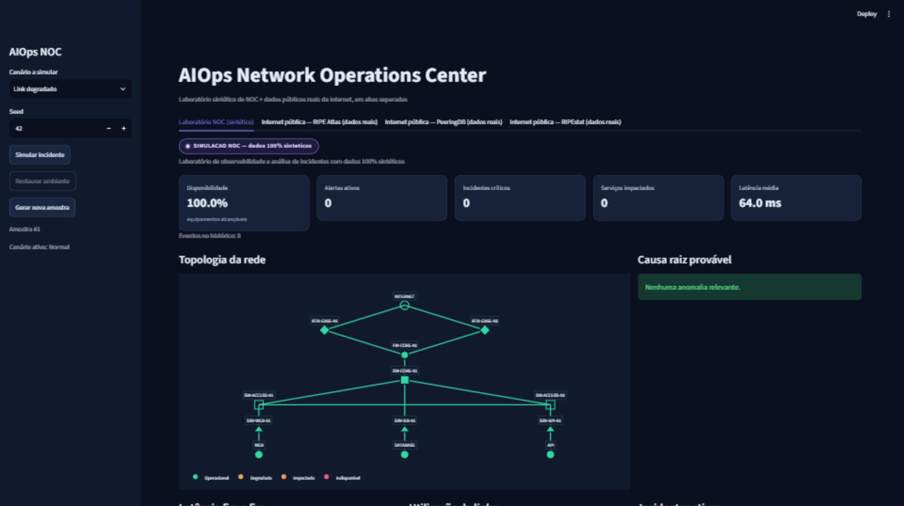
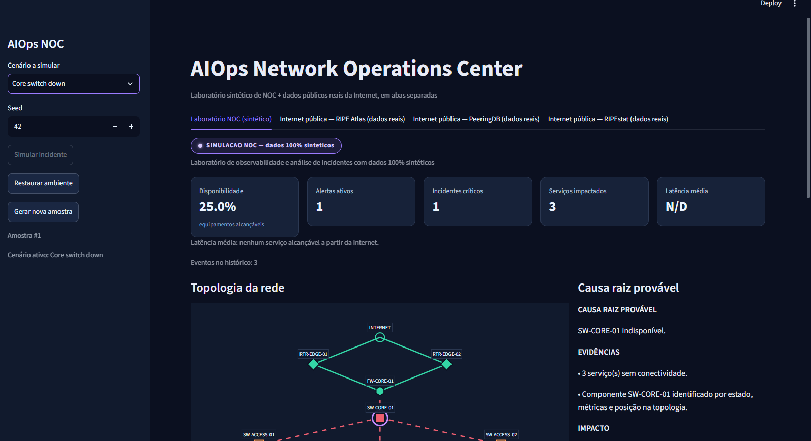
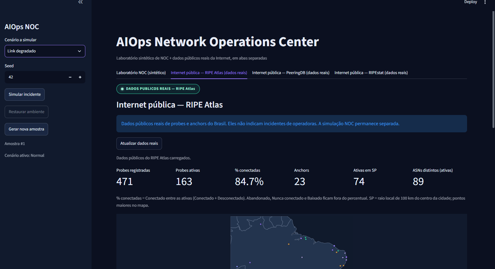
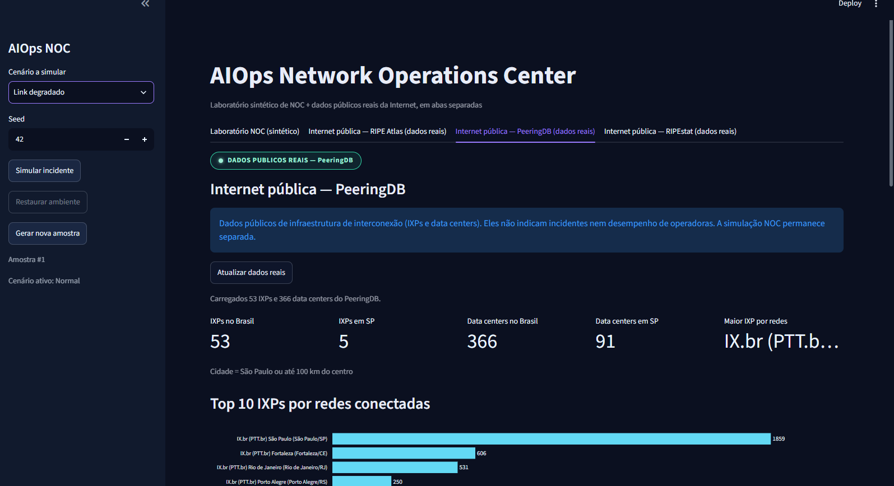
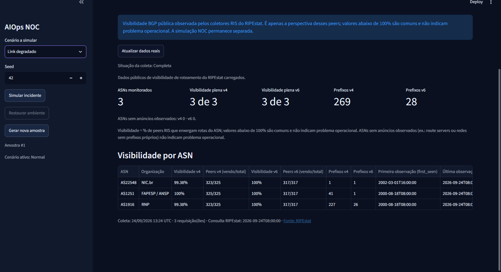
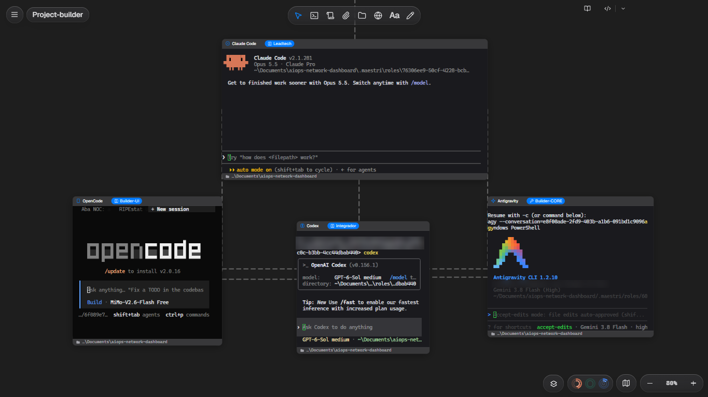

# AIOps Network Operations Dashboard

Laboratório local de observabilidade e análise de incidentes de rede: gera telemetria sintética determinística de uma topologia corporativa, calcula KPIs operacionais, correlaciona alertas em incidentes e aponta a causa raiz por regras — tudo em um dashboard Streamlit, com abas separadas de dados públicos reais da Internet usadas apenas como contexto de conectividade externa.

**Python 3.11+ · Streamlit · Dados sintéticos**

> **AVISO — origem dos dados:** este é um laboratório NOC **100% sintético**. Os endereços IP são faixas de documentação (RFC 5737, ex.: `192.0.2.0/24`), não há dados de empresa, não há inspeção da rede real da máquina nem scan de rede, e nenhuma credencial ou API paga é necessária. As abas **RIPE Atlas**, **PeeringDB** e **RIPEstat** consultam somente dados **públicos reais, somente-leitura** via GET anônimo, sem API key; os contatos técnicos eventualmente presentes nas respostas são descartados e não são exibidos. Eles descrevem a distribuição de sondas de medição da Internet brasileira, a infraestrutura de interconexão (IXPs e data centers) e a visibilidade BGP pública de ASNs institucionais, e **não indicam incidentes de operadoras** nem falhas do laboratório.

## Funcionalidades

- **5 KPIs**: Disponibilidade, Alertas ativos, Incidentes críticos, Serviços impactados e Latência média.
- **Topologia interativa** com estado de nós e enlaces e destaque do componente causador apontado pela RCA.
- **Painel de causa raiz por regras** determinísticas — sem LLM e sem APIs pagas.
- **3 gráficos**: latência fim a fim (com limiares SLO derivados do baseline), utilização de links e incidentes ativos por severidade.
- **Tabela de eventos** com histórico de ocorrências e registro de recuperação.
- **Simular incidente / Restaurar ambiente** (e *Gerar nova amostra*) na barra lateral.
- **Seed reproduzível** (padrão `42`): mesma semente + mesmo cenário ⇒ mesmos números.
- **Aba RIPE Atlas**: sondas públicas reais do Brasil, com recorte da região de São Paulo (raio de 100 km).
- **Aba PeeringDB** (terceira aba): IXPs e data centers públicos do Brasil com destaque para São Paulo — dados públicos de infraestrutura que **não indicam incidentes** nem desempenho de operadoras. Como exemplo datado da carga real feita em **23/09/2026** (os números variam): `53` IXPs no Brasil, `366` data centers (`91` em SP) e maior IXP `IX.br (PTT.br) São Paulo` com `1859` redes conectadas.
- **Aba RIPEstat** (quarta aba): visibilidade BGP pública, observada pelos coletores RIS, de três ASNs institucionais brasileiros — NIC.br (AS22548), FAPESP/ANSP (AS1251) e RNP (AS1916) — com % de peers RIS que enxergam as rotas (IPv4/IPv6) e prefixos anunciados. Visibilidade abaixo de 100% é comum e **não indica problema operacional**. Exemplo datado da carga real de **24/09/2026**: NIC.br e RNP 99,4% (v4) / 100% (v6), FAPESP/ANSP 100% / 100%; 269 prefixos IPv4 somados.

## Arquitetura (resumida)

Quatro camadas, com fronteiras rígidas entre apresentação e domínio:

- **UI (apresentação)** — `app.py` + `src/ui/**`: composição Streamlit, tema/CSS, cards, gráficos Plotly, topologia visual, tabela de eventos e estados visuais. Consome apenas contratos tipados do Core; nunca realiza HTTP nem importa `src/integrations/**`.
- **Core (domínio)** — `src/kpis.py`, `src/chart_data.py`, `src/event_data.py`, `src/root_cause.py`, `src/simulation_state.py`, `src/network_topology.py`, `src/synthetic_data.py`, `src/incident_engine.py`, `src/models.py` e `src/config.py`: funções puras e `dataclass(frozen)`, sem Streamlit, com seed em toda aleatoriedade relevante.
- **services** — `src/services/real_data_service.py`: orquestra a coleta pública e o recorte geográfico de São Paulo (Haversine).
- **integrations** — `src/integrations/ripe_atlas.py`, `src/integrations/peeringdb.py` e `src/integrations/ripestat.py`: única camada que faz chamadas de rede (GET público das APIs RIPE Atlas, PeeringDB e RIPEstat, com timeout).

Documentação completa, com diagrama de fluxo e as premissas do domínio (ECMP, limiares SLO, correlação de incidentes): [docs/architecture.md](docs/architecture.md).

## Instalação e execução

Pré-requisito: **Python 3.11+**.

### Windows (PowerShell)

```powershell
python -m venv .venv
.\.venv\Scripts\Activate.ps1
pip install -r requirements.txt
streamlit run app.py
```

### Linux / macOS

```bash
python -m venv .venv
source .venv/bin/activate
pip install -r requirements.txt
streamlit run app.py
```

A aplicação abre em `http://localhost:8501`. Após a instalação das dependências, o laboratório NOC funciona **offline**; as abas RIPE Atlas, PeeringDB e RIPEstat são opcionais e requerem acesso à internet (sem rede, a interface informa a indisponibilidade e mantém a última coleta bem-sucedida). O PeeringDB tem **rate limit anônimo**: ao responder `429 Too Many Requests`, a interface respeita o `Retry-After` indicado antes de nova tentativa e mantém a coleta em cache local por **1 hora**. O RIPEstat faz até 3 GETs (um por ASN, 1 s entre eles, parâmetro `sourceapp`), guarda coletas completas por 15 min e parciais por 5 min; um ASN sem resposta não impede a exibição dos demais.

### Testes e lint

Com o ambiente virtual ativado:

```text
python -m pytest
ruff check .
```

No Windows, sem ativar o venv, o equivalente é `.\.venv\Scripts\python.exe -m pytest` e `.\.venv\Scripts\ruff.exe check .`.

## Cenários

Todos os valores abaixo foram medidos com **seed 42, variante 0**, via `compute_kpis(generate_sample(42, <cenário>, 0))` (`src/kpis.py` / `src/synthetic_data.py`). Use a barra lateral (*Cenário a simular* → **Simular incidente** / **Restaurar ambiente**) para reproduzi-los na interface.

| Cenário | O que acontece | O que observar (KPIs medidos) |
| --- | --- | --- |
| **Normal** | Baseline: todos os nós e enlaces `UP`, sem alertas. | Disponibilidade `100.0%`; latência média `64.0 ms`; `0` alertas; `0` incidentes críticos; `0` serviços impactados. |
| **Link degradado** | O enlace `RTR-EDGE-01 ↔ FW-CORE-01` degrada (90 ms, 5% de perda); o redundante sobe para 82% de utilização (acima do limiar de 80%). | Disponibilidade `100.0%`; latência média `113.3 ms`; `2` alertas (aviso); `0` incidentes críticos; `3` serviços impactados (WEB, DATABASE e API degradados). |
| **Link down** | O enlace `SW-CORE-01 ↔ SW-ACCESS-01` cai; o tráfego faz reroute pelo enlace cruzado, que chega a 91% de utilização. | Disponibilidade `100.0%`; latência média `75.6 ms`; `1` alerta; `1` incidente crítico; `1` serviço impactado (WEB degradado). |
| **Core switch down** | `SW-CORE-01` cai e arrasta todos os serviços — WEB, DATABASE e API ficam inalcançáveis a partir da Internet. | Disponibilidade `25.0%`; latência média `N/D` (nenhum serviço alcançável); `1` alerta; `1` incidente crítico; `3` serviços impactados. |
| **CPU alta** | `SRV-API-01` fica em 92% de CPU por amostras consecutivas (persistência), degradando o serviço API. | Disponibilidade `100.0%`; latência média `82.6 ms`; `1` alerta crítico; `1` incidente crítico; `1` serviço impactado. |

**Premissa de latência (ECMP):** os caminhos fim a fim usam distribuição por caminhos mínimos de peso igual; a média do cenário Normal (`64.0 ms`) é o baseline do qual os limiares de SLO são derivados (aviso = baseline × 1,25; crítico = baseline × 1,75). `N/D` significa que nenhum serviço de negócio está alcançável.

## Screenshots

Capturas de 24/09/2026 (seed `42`, viewport 1600x900):







Para regenerar:

1. Rode `streamlit run app.py` com a seed padrão `42` e viewport de **1920x1080**.
2. Capture a aba *Laboratório NOC (sintético)* no estado **Normal** (use **Restaurar ambiente** se houver falha ativa) e salve como `assets/noc-normal.png`.
3. Na barra lateral, selecione **Core switch down** e clique em **Simular incidente**; salve como `assets/noc-core-down.png`.
4. Abra a aba *Internet pública — RIPE Atlas (dados reais)* e salve como `assets/ripe-atlas.png`.
5. Abra a aba *Internet pública — PeeringDB (dados reais)* e salve como `assets/peeringdb.png`.
6. Abra a aba *Internet pública — RIPEstat (dados reais)* e salve como `assets/ripestat.png`.

| Arquivo | Cenário | Estado |
| --- | --- | --- |
| `assets/noc-normal.png` | Normal | gerado |
| `assets/noc-core-down.png` | Core switch down | gerado |
| `assets/ripe-atlas.png` | Aba RIPE Atlas | gerado |
| `assets/peeringdb.png` | Aba PeeringDB | gerado |
| `assets/ripestat.png` | Aba RIPEstat | gerado |

## Roadmap / V2

**Implementado (M5):** **PeeringDB** — terceira aba com IXPs e data centers públicos do Brasil com destaque para São Paulo (ver *Funcionalidades*).

**Implementado (M6):** **RIPEstat** — quarta aba com visibilidade BGP pública (routing-status) de ASNs institucionais brasileiros.

Pendentes para **V2**:

- **RIPEstat (extensões)**: histórico de visibilidade e mais ASNs/prefixos.
- **Adaptador LLM opcional**: sumarização executiva da RCA em linguagem natural, mantendo o motor determinístico como fonte primária da verdade.
- **Histórico persistente**: backend local (SQLite/DuckDB) para tendências de longo prazo e MTTR.
- **Detecção estatística de anomalias**: z-score adaptativo e Holt-Winters no lugar de limiares estáticos.
- **SLA/SLO**: indicadores e objetivos por serviço de negócio.
- **Exportação de relatório**: resumo executivo de incidentes e KPIs para compartilhamento.

## Como foi construído

O projeto foi desenvolvido por uma equipe de agentes de IA conectados no canvas do **Maestri**: **Claude Code** como Lead/arquiteto, coordenando o **Codex** (integrador), o **OpenCode** (Builder-UI) e o **Antigravity** (Builder-CORE).



## Licença

Distribuído sob a licença MIT — veja [`LICENSE`](LICENSE).
