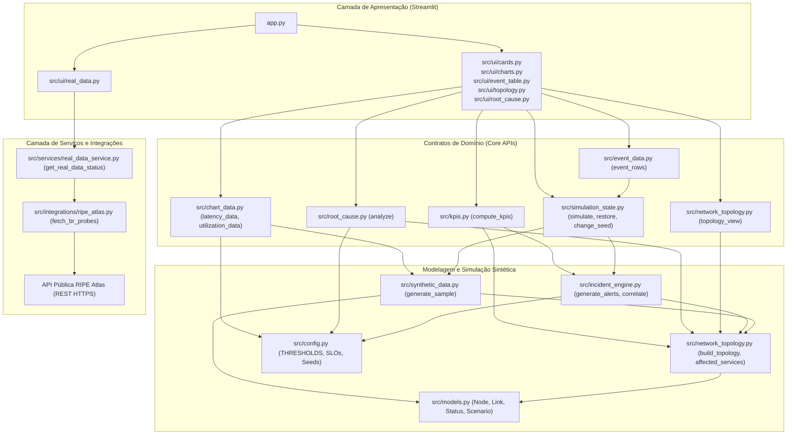

# Arquitetura do Sistema — AIOps Network Operations Dashboard

## 1. Visão Geral da Arquitetura

O **AIOps Network Operations Dashboard** é uma plataforma de observabilidade e engenharia de confiabilidade de rede projetada para operar em ambiente local (*air-gapped* e sem dependências de infraestrutura corporativa real). O sistema estrutura-se sobre duas camadas de dados completamente segregadas:

1. **Laboratório NOC (100% Sintético)**: Ambiente simulado de telemetria de rede enterprise/datacenter (nós, enlaces, serviços de negócio, consumo de CPU, latência, perda de pacotes e disponibilidade). Essa camada alimenta todo o fluxo de monitoramento operacional, correlação de alertas, geração de incidentes e análise determinística de causa raiz (RCA).
2. **Internet Pública (RIPE Atlas — Dados Reais)**: Monitoramento da infraestrutura externa de sondas de medição ativas no Brasil coletadas via API pública da RIPE NCC. **Esses dados refletem a topologia de sondas da Internet brasileira e NÃO indicam incidentes ou falhas na rede do laboratório**, servindo estritamente como telemetria de contexto de conectividade externa.

---

## 2. Diagrama de Camadas e Fluxo de Dados

A arquitetura adota uma separação estrita de responsabilidades (*Clean Architecture* orientada a contratos):

* **Fronteira da UI**: A camada de visualização (`src/ui/**` e `app.py`) **nunca** realiza requisições HTTP, **nunca** importa módulos de `src/integrations/**`, e consome dados exclusivamente por contratos imutáveis tipados expostos pelo Core ou pelo Service.
* **Fronteira do Core**: O domínio do laboratório (`src/kpis.py`, `src/chart_data.py`, `src/event_data.py`, `src/root_cause.py`, `src/simulation_state.py`, `src/network_topology.py`) **nunca** importa `streamlit` e baseia-se em funções puras e estruturas `@dataclass(frozen=True)`.



---

## 3. Modelo da Topologia de Rede e Cenários de Falha

### 3.1 Grafo da Topologia
A topologia de referência simulada (`src/network_topology.py`) modela a borda e o trânsito interno até os serviços de aplicação:

* **Ponto de Origem**: `INTERNET`.
* **Borda com Redundância Ativa (ECMP)**: Dois roteadores de borda (`RTR-EDGE-01` e `RTR-EDGE-02`) com enlaces paralelos redundantes convergindo no firewall de borda `FW-CORE-01`.
* **Ponto Único de Falha (SPOF)**: O switch de agregação `SW-CORE-01` conecta o firewall `FW-CORE-01` a toda a distribuição interna.
* **Distribuição e Acesso**: Dois switches de acesso (`SW-ACCESS-01` e `SW-ACCESS-02`) com um enlace de interconexão cruzada direta entre si para failover/reroute.
* **Servidores e Serviços**:
  * `SW-ACCESS-01` atende `SRV-WEB-01`, que provê o serviço `WEB`.
  * `SW-CORE-01` conecta-se diretamente a `SRV-DB-01`, que provê o serviço `DATABASE`.
  * `SW-ACCESS-02` atende `SRV-API-01`, que provê o serviço `API`.

### 3.2 Cenários Operacionais (`src/models.py: Scenario`)
As amostras sintéticas determinísticas são geradas em `src/synthetic_data.py: generate_sample`:

1. **Normal (`Scenario.NORMAL`)**: Todos os nós e enlaces operam em `Status.UP`. Utilização típica entre 12% e 55%, latência por salto entre 2 e 16 ms, perda de pacotes < 0.8%, e disponibilidade em 100%.
2. **Link Degradado (`Scenario.LINK_DEGRADED`)**: O enlace `RTR-EDGE-01 ↔ FW-CORE-01` entra em `Status.DEGRADED` (latência salta para 90 ms e perda de pacotes para 5%). O enlace redundante `RTR-EDGE-02 ↔ FW-CORE-01` absorve tráfego adicional (utilização atinge 82%, ultrapassando o limiar de congestionamento `CONGESTION_THRESHOLD_PCT = 80.0%`). Os serviços sofrem aumento ponderado de latência pelo ECMP.
3. **Link Down com Reroute (`Scenario.LINK_DOWN`)**: O enlace `SW-CORE-01 ↔ SW-ACCESS-01` entra em `Status.DOWN`. O tráfego para `SW-ACCESS-01` é forçado a realizar *reroute* através do enlace cruzado `SW-ACCESS-01 ↔ SW-ACCESS-02` (utilização atinge 91%). O serviço `WEB` é classificado como `Status.DEGRADED` pelo aumento de saltos (*hops*) no caminho mínimo e congestionamento do enlace alternativo.
4. **Core Switch Down — Falha Catastrófica (`Scenario.CORE_SWITCH_DOWN`)**: O nó `SW-CORE-01` entra em `Status.DOWN` e todos os seus enlaces incidentes caem. Como `SW-CORE-01` é o ponto central de trânsito, todos os serviços (`WEB`, `DATABASE`, `API`) tornam-se inalcançáveis a partir da `INTERNET`. A disponibilidade despenca para 25% (apenas a borda externa permanece alcançável) e a latência média fim a fim torna-se indefinida (`None` / `N/D`).
5. **CPU Alta em Servidor (`Scenario.CPU_HIGH`)**: O servidor `SRV-API-01` atinge 92% de CPU (`Status.DEGRADED`), induzindo uma penalidade sintética de latência de 30 a 60 ms no nó. Gera persistência de 12 amostras consecutivas acima de 90%, degradando o serviço `API`.

---

## 4. Premissas e Regras de Negócio do Domínio

1. **Roteamento ECMP e Saltos Mínimos**:
   * O cálculo de conectividade fim a fim utiliza `networkx.all_shortest_paths` sobre o subgrafo de nós e enlaces ativos (`Status != Status.DOWN`).
   * Quando existem múltiplos caminhos mínimos (ex: via `RTR-EDGE-01` ou `RTR-EDGE-02`), o tráfego é distribuído com pesos iguais (ECMP), calculando a latência do serviço pela média aritmética dos caminhos.
   * Se o comprimento do caminho ativo exceder o caminho mínimo do baseline de referência (`networkx.shortest_path_length + 1`), o serviço é marcado como `Status.DEGRADED` por *reroute*.
2. **Disponibilidade Global (`src/kpis.py: compute_kpis`)**:
   * A disponibilidade do laboratório é definida estritamente como a porcentagem de nós monitorados (excluindo o nó virtual `INTERNET`) alcançáveis a partir da `INTERNET` através do grafo ativo.
   * Nós com `Status.DEGRADED` são considerados **operacionalmente disponíveis** (apenas nós inalcançáveis ou `Status.DOWN` reduzem o KPI).
3. **Latência Média e Penalidades Operacionais (`src/network_topology.py: mean_service_latency`)**:
   * A latência média fim a fim é calculada exclusivamente sobre serviços de negócio alcançáveis. Se nenhum serviço estiver alcançável (ex: `CORE_SWITCH_DOWN`), o valor é `None` (exibido na UI como "N/D").
   * Enlaces com utilização $\ge 80\%$ sofrem acréscimo de penalidade de congestionamento (+20 ms). Servidores sob CPU elevada adicionam sua latência própria de processamento.
4. **Limiares de SLO Relativos ao Baseline (`src/config.py`, `src/chart_data.py`)**:
   * Em vez de valores absolutos arbitrários, os limiares de SLO de latência são dinâmicos e calculados com base na média do cenário normal da semente:
     * **SLO Aviso**: $1.25 \times \text{baseline}$ (`SLO_WARNING_FACTOR = 1.25`).
     * **SLO Crítico**: $1.75 \times \text{baseline}$ (`SLO_CRITICAL_FACTOR = 1.75`).
   * No cenário normal, o ruído gaussiano ($\sigma = 1.2\text{ ms}$) é restrito de modo que a série temporal **nunca** cruza o limiar de aviso.
5. **Persistência de CPU e Supressão de Ruído (`src/incident_engine.py`)**:
   * Alertas de CPU transitórios são classificados como aviso. Apenas leituras com $\ge 6$ amostras consecutivas (`CPU_PERSISTENCE_POINTS = 6`) acima de 90% (`CPU_HIGH_THRESHOLD = 90.0%`) escalam o alerta para `Severity.CRITICAL`.
6. **Correlação Determinística de Incidentes (`src/incident_engine.py: correlate`)**:
   * Alertas individuais (`Alert`) são agrupados por componente causador (`cause`).
   * O ID do incidente é gerado deterministicamente por hash:
     $$\text{digest} = \text{SHA256}(\text{cause})[:10].\text{upper}() \implies \text{ID} = \text{"INC-" + digest}$$
7. **RCA Determinística por Regras Topológicas (`src/root_cause.py: analyze`)**:
   * Não utiliza LLMs ou modelos probabilísticos.
   * Ordena anomalias por proximidade à origem (`INTERNET`), priorizando falhas a montante (*upstream*). Em caso de empate de distância, prioriza nós inoperantes (0), nós com sobrecarga de CPU (1) e enlaces degradados/inoperantes (2).
   * Identifica o tipo do componente (`component_kind: 'node' | 'link'`), nós participantes (`component_nodes`) e emite ações de remediação recomendadas genéricas e não destrutivas (ex: validação de caminhos e monitoramento no laboratório).

---

## 5. Gerenciamento de Estado e Reprodutibilidade

O controle de simulação do laboratório é centralizado em `src/simulation_state.py` e mantido na sessão da interface através do `st.session_state`:

* **Parâmetros Fundamentais**: Cada estado é indexado por um `seed` (padrão `DEFAULT_SEED = 42`) e uma `variant` (índice da amostra no tempo). A aleatoriedade do NumPy é isolada deterministicamente via geradores independentes `np.random.default_rng([seed, variant, ...])`.
* **Transição de Cenários (`simulate`)**: Ao acionar uma anomalia, os incidentes ativos anteriores são marcados como `"Resolvido"` no histórico e os novos eventos são adicionados com timestamps sequenciais ordenados.
* **Restauração do Ambiente (`restore`)**: Ao restaurar para o cenário normal, o sistema insere um evento explícito de auditoria (`"Recuperação do ambiente"` com severidade `Informativo` e host `"AMBIENTE"`), limpando incidentes ativos e preservando o histórico preexistente.
* **Troca de Semente (`change_seed`)**: Ao selecionar um novo seed, o histórico acumulado de eventos anteriores é preservado; caso haja um cenário de falha em execução, ele é reaplicado deterministicamente na nova semente, marcando a descrição do evento com `"(reaplicado após troca de seed)"` e reiniciando a variante em 0.

---

## 6. Integração com a Internet Pública (RIPE Atlas)

A camada de dados reais consulta a rede global de sondas do RIPE NCC para contextualizar a conectividade externa da Internet brasileira.

### 6.1 Detalhes de Transporte e Segurança
* **Endpoint**: `https://atlas.ripe.net/api/v2/probes/` (`RIPE_ATLAS_BASE_URL`).
* **Método e Autenticação**: Exclusivamente `GET` público, **sem tokens, sem credenciais e sem APIs pagas**.
* **Parâmetros da Consulta**:
  * `country_code=BR`
  * `page_size=500` (`RIPE_ATLAS_PAGE_SIZE`)
  * `fields=id,status,asn_v4,asn_v6,geometry,is_anchor`
* **Políticas de Resiliência (`src/integrations/ripe_atlas.py`)**:
  * Timeout individual por requisição: 10 s (`RIPE_ATLAS_TIMEOUT_SECONDS`).
  * Orçamento total de tempo por ciclo de coleta: 20 s (`RIPE_ATLAS_TOTAL_BUDGET_SECONDS`).
  * Limite máximo de paginação: 6 páginas (`RIPE_ATLAS_MAX_PAGES = 6`).
  * Se o tempo total estourar entre páginas, a coleta é interrompida elegantemente e o resultado é marcado com `truncated=True` e `truncated_reason="time_budget"`.
* **Validação e Privacidade**:
  * Registros sem campos obrigatórios ou com tipos inconsistentes são descartados e contabilizados em `invalid_count`.
  * Nenhum endereço IP real, rota BGP sensível ou identificador de host é capturado.
* **Recorte Regional de São Paulo (`src/services/real_data_service.py`)**:
  * Calcula distância geográfica através da fórmula trigonométrica de Haversine:
    $$\Delta\sigma = 2 \arcsin\left(\sqrt{\sin^2\left(\frac{\Delta\phi}{2}\right) + \cos(\phi_1)\cos(\phi_2)\sin^2\left(\frac{\Delta\lambda}{2}\right)}\right)$$
  * Sondas em raio $\le 100\text{ km}$ (`SAO_PAULO_RADIUS_KM = 100`) das coordenadas da capital paulista (`SAO_PAULO_LAT = -23.55`, `SAO_PAULO_LON = -46.63`) são marcadas como `em_sp=True`.
* **Estratégia de Cache e Cooldown na UI (`src/ui/real_data.py`)**:
  * `@st.cache_data(ttl=600)`: Cache de dados válidos por 10 minutos (`RIPE_ATLAS_CACHE_TTL_SECONDS = 600`).
  * Em caso de falha de conexão, a exceção **não** é armazenada no cache; o sistema exibe a última coleta bem-sucedida (`st.session_state["real_data_last_ok"]`) acompanhada de um banner de aviso de indisponibilidade momentânea (*stale data fallback*).
  * Cooldown de recarga manual de 60 segundos (`REFRESH_COOLDOWN_SECONDS = 60`) para evitar sobrecarga no serviço público.

---

## 7. Estratégia de Testes e Garantia de Qualidade

A integridade do sistema é garantida por uma bateria automatizada de testes sem qualquer chamada de rede externa:

```powershell
# Execução da suíte completa de testes
.\.venv\Scripts\python.exe -m pytest

# Verificação estática de tipos, padrões e imports
.\.venv\Scripts\python.exe -m ruff check .

# Verificação de conformidade de formatação de código
.\.venv\Scripts\python.exe -m ruff format --check .
```

* **Testes Sem Rede**: Todos os testes da integração RIPE Atlas (`tests/test_ripe_atlas.py` e `tests/test_real_data_service.py`) utilizam injeção de dependência via openers customizados (`urllib.request.OpenerDirector`), mocks em memória e relógios injetáveis (`clock: Callable[[], float]`).
* **Testes de Invariantes Estatísticos e SLO**: `tests/test_chart_data.py` valida 200 sementes aleatórias em múltiplas variantes, garantindo formalmente que a latência no cenário normal jamais cruza o limiar de SLO aviso.

---

## 8. Limitações Conhecidas e Evolução Futura (V2)

1. **Fontes Públicas Complementares**:
   * Integração com **RIPEstat API** para telemetria de anúncios BGP, visibilidade de rotas e reputação de ASNs.
   * Integração com **PeeringDB** para validação de conexões públicas em Pontos de Troca de Tráfego (IX.br / PTT).
2. **Assistente de Diagnóstico (Adaptador LLM Opcional)**:
   * Interface extensível baseada em provedor abstrato para enriquecer a RCA com sumarizações executivas e sugestões de playbook em linguagem natural, mantendo o motor determinístico como fonte primária da verdade.
3. **Persistência Histórica e Banco de Dados**:
   * Evolução do estado mantido em memória (`st.session_state`) para um backend persistente local (SQLite / DuckDB / TimescaleDB), permitindo análise de tendências de longo prazo e MTTR (*Mean Time to Resolve*).
4. **Detecção Estatística Avançada de Anomalias**:
   * Substituição progressiva de limiares estáticos por algoritmos estatísticos (z-score adaptativo, Holt-Winters e decomposição sazonal) para detecção proativa de degradação.
